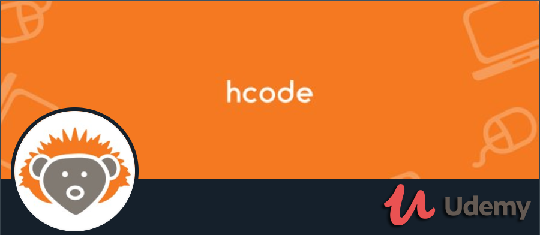

</img>
<h1 align="center">Udemy | Desenvolvedor Web | H-Code</h1>
<p align="center">Projeto <strong>Site Orlando City</strong> desenvolvido durante o curso da HCODE</p>

<p align="center">
  <a aria-label="Versão do jQuery" href="https://jquery.com/download/">
    </img>
  </a>
  <a aria-label="Versão do BootStrap" href="https://getbootstrap.com/docs/4.4/getting-started/download/">
    </img>
  </a>
  <a aria-label="Versão do Xampp" href="https://www.apachefriends.org/pt_br/index.html">
    </img>
  </a>
  <a aria-label="Desafios" href="DESAFIOS.md">
  	</img>
  </a>

</p>

## Instalação
Configure o Apache e atualize a string de conexão com seu `User:Senha` no arquivo `index.js`.  
Para instalar as dependências e executar o **Servidor** (modo desenvolvimento), clone o projeto em seu computador e em seguida execute:
```bash
cd backend
yarn install
yarn dev
```
Para iniciar o **Frontend** do React utilize os comandos:
```bash
cd frontend
yarn install
yarn start
```
Assim que o processo terminar, automaticamente será aberta no seu navegador a página `localhost:3000` contendo o Projeto desenvolvido no dia 3 de 5.  

Para testar o **Mobile** do React Native, primeiro coloque o endereço do seu servidor (ou computador) no arquivo `src/services/api.js`, e depois execute os comandos:
```bash
# NÃO é preciso executar a linha de baixo caso ja tenha o Expo (CLI) instalado!
yarn global add install expo-cli
cd mobile
yarn install
yarn start
```
Assim que o processo terminar, automaticamente será aberta no seu navegador a página `localhost:3000`. Conecte seu emulador, ou teste o aplicativo por `LAN`: baixe o aplicativo *Expo* da Play Store ou App Store e em seguida escaneie o código QR.

## Backend
Veja em [backend/README.md](./backend) para informações sobre o Backend e arquitetura.

## Frontend
Veja em [frontend/README.md](./frontend) para informações sobre o Frontend e os padrões. O Frontend desenvolvido (com o [desafio](DESAFIOS.md) feito) ficou assim:

</img>

## Responsive
O App Mobile (React Native) desenvolvido no Dia 4 e aprimorado no Dia 5 com Sockets (+ o [desafio](DESAFIOS.md) feito) ficou assim:

</img>


## Licença

[MIT](./LICENSE) &copy; [Udemy](https://www.udemy.com/terms/)
